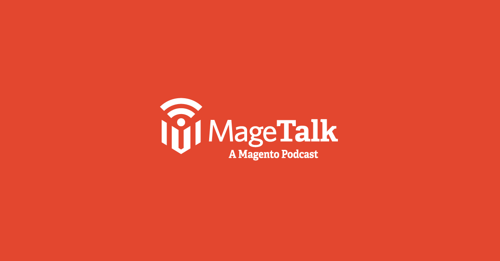
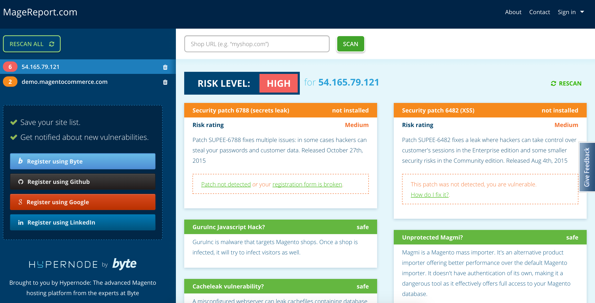

footer: ©2015 Philwinkle LLC __Meet Magento Spain 2015__
slidenumbers: true

# Wow Such PCI Compliance
### _**Very card, wow security wow**_
#### Phillip Jackson Lead Magento Architect, Something Digital

---

# @philwinkle
# [fit] github.com/philwinkle

---

# @magetalk

---

# _PCI Myths_

---

## 1. If I _**don't store**_ credit cards PCI _**doesn't apply**_

---

# [fit] _FALSE_

---

> The only way to avoid PCI compliance is to transfer the risk entirely to someone else ... where credit card information never traverses your own servers[^1]

-- Focus on PCI

---

## 2. Magento is PCI Compliant, so therefore _**I'm PCI compliant**_

---

# [fit] _FALSE_

### **(kinda)**

---

### Magento is PCI DSS compliant _only_ when used *in conjuction* with Secure Payment Bridge[^2]

---

# Why isn't Magento *itself* PCI compliant?

- Magento is monolithic 
- Swift update deployment
- Limit the scope of feature impact
- $$$$

---

## 3. I am in the EU/AUS/Antarctica and I don't need to abide by PCI

---

# [fit] _FALSE_

---

# You can't un-hack your site

---

---

---

# [fit]How long until a _default Magento CE 1.9.0.0_ is **hacked**?

---

# [fit]18 minutes

---

---

## _Common PCI failures_

---

## Do you use _**3rd party**_ modules?

---

## Do you use _source control_ for deployments?

#### _Check yoursite.com/.git and yoursite.com/var right away_

---

## What happens if  _**an employee**_ takes a credit card _over the phone?_

---

## _Do you have WiFi?_  I bet you do.

---

## When was your last _security scan?_

---

## What is your _log retention policy_ and is it stored **offsite**, and for _**how long**_?

--- 

## What is your _password policy?_

---

## What _do you do_ in case of a data breach?

---

## What is your _backup strategy?_

---

## Do you have a _staging environment?_

---

## Do you have _separate_ development environments?

---

## Do you _copy live customer data_ to your development or staging environments?

---

# [fit] _Are you scared yet?_

---

## How do I get compliant?

---

# [fit] Convenient _12-step_ Program

---

## _Build_ and __*Maintain*__ a Secure Network 

1. _Install and maintain_ a firewall
2. Do not use vendor-supplied _defaults_

---

## Protect Cardholder Data 

3. Protect _stored cardholder data_
4. _Encrypt transmission_ of cardholder data

---

## _Maintain_ a Vulnerability Management Program 

5. _Use_ and _regularly update_ anti-virus software 
6. Develop and maintain secure systems and applications

---

# [fit] _Yes_, auditors will require AV  on production hardware

---

## _Yes_ this is dumb
#### Look into these: _ClamAV_ (free), _Sophos_ (inexpensive)

---

# [fit] To _develop_ secure systems we _must_ employ tools

---

# [fit] _Tools to assist in secure code delivery_

- FOSS tools[^3]
    - RIPS for PHP
    - SQLmap
    - OWASP Xenotix XSS Exploit Framework
- WAF 
    - Mod Security
    - Amazon WAF
- Internal code audit
    - Bitbucket
    - Github
- Paid scanners
    - Verisign

---

## Implement _Strong_ Access Control Measures 

7. Restrict employee access to cardholder data
8. Assign a unique ID to each person 
9. Restrict physical access 

---

## Regularly _Monitor and Test_ Networks 

10. Track and monitor all access to network resources and cardholder data 
11. Regularly test security systems and processes

---

## _Maintain_ an Information Security Policy 

12. Maintain a policy that addresses information security

#### Sample policies available online[^4][^5]

---

# [fit] _Freedom_

---

# Conclusion

---

# [fit] This sounds _hard_

---

# [fit] Let's make it _easier_

---

## Ways we can _**contribute**_ as a community

- Security Stackexchange
- Magento Stackexchange
- Magento Subreddit (r/magento)

---

## Ways we can _**stay secure**_

- OWASP mailing list
- Magento security mailing list
- Managed hosting
- Policy reminders

---

## Perform an assessment

---

# [fit] _Magento ECG Coding Standard_

- anywhere you see __**`$_GET`**__, be scared
- anywhere you see direct SQL, be scared

---

# [fit] _Run MageReport_

- Byte.nl 
- Scans for patch vulnerability and other issues

---

# _Thank you!_

### somethingdigital.com
### @philwinkle
### github.com/philwinkle

[^1]: http://www.focusonpci.com/site/index.php/articles/pci-misconceptions.html

[^2]: http://magento.com/resources/pci

[^3]: http://www.isaca.org/Groups/Professional-English/pci-compliance/GroupDocuments/Meet%20PCI%20DSS%20Requirements%20with%20FOSS.pdf

[^4]: https://www.dmoz.org/Computers/Security/Policy/Sample_Policies/

[^5]: https://github.com/catalyzeio/policies